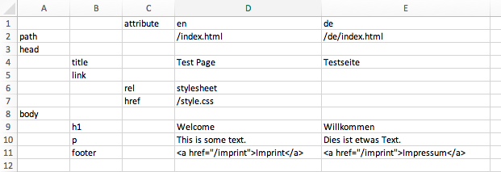

# xlgen
xlgen is a static website generator using Excel files to manage content.
Every page is specified in an Excel sheet and looks as simple as this:



The rules are simple:

- The top row sets the locales you have content for.
- The second row provides the file path for the generated localized HTML files.
- The leftmost columns represent an HTML element structure.
- After the structure columns there is always a column called "attribute". Entries here define attributes for the HTML elements.
- Values in the locale-specific columns to the right are the localized content. You can set one value for all locales by just setting the leftmost value.
- Values have to be valid HTML themselves.

xlgen expects you to store your site in a specific folder structure that
might look like this:

```
`-- site1
    |-- spec
    |   |-- site1.xlsx
    |   `-- static
    |       `-- style.css
    `-- www
        |-- de
        |   |-- impressum
        |   |   `-- index.html
        |   `-- index.html
        |-- imprint
        |   `-- index.html
        |-- index.html
        `-- style.css
```

xlgen always expects a folder called `spec` to be present,
containing multiple `.xlsx` files with sheets containing page specifications.
Optionally, there can be a folder `spec/static` that will be used
to pre-fill the generated site with static files such as images,
CSS, and JavaScript.

From within the site's folder, you can call xlgen directly:

```
$ cd site1
$ xlgen
``` 

It will then create the `www` folder and put the generated site there.
If the folder already exists, it will be deleted and recreated with
freshly generated files.

## To-Dos

xlgen is work in progress, so do not expect too much ;)

Features I am intending to add include:

- Templating
- Link prefixing